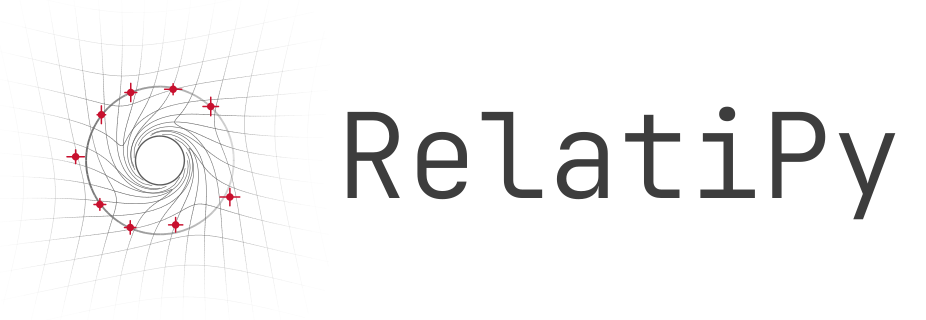

<h1 align="center">
  <picture>
    <source media="(prefers-color-scheme: dark)" srcset="docs/_static/logo-dark.svg">
    
  </picture>
</h1>

Numerical tools for relativistic geometry: timelike geodesics in the Kerr
spacetime, with a Python interface built on Astropy units and a native C core.

RelatiPy keeps the physics and the numerical integration in C. Python validates
inputs, handles physical units, exposes immutable result objects, and performs
post-integration interpolation. A private Cython binding connects the two
layers; the integration loop makes no Python callbacks.

> **Status:** research software under active development (version 1.1.0).
> The first public interface covers scalar timelike orbits around a Kerr black
> hole. See [scope and limits](docs/integration-roadmap.rst) before relying on
> results.

## Features

- **Kerr geometry.** `Kerr(mass=..., spin=...)` with `0 <= spin <= 1`,
  gravitational radius `r_g = GM/c²`, horizons, prograde/retrograde ISCO and
  photon-orbit radii, and the ergosurface.
- **Several initial-condition families.** Classical elements
  `(a, e, inc, Omega, omega, f)`, Cartesian, spherical, or Boyer–Lindquist
  position and coordinate velocity, and bound Kerr parameters
  `(p, e, x, q_r0, q_theta0, q_phi0)` via `KerrOrbitalElements`.
- **Native integrators.** `"radau"` (default, Radau IIA(5)), `"dop853"`,
  `"dp45"`, and `"projection_radau"`, which projects each accepted step toward
  the initial norm, energy, axial angular momentum, and Carter constant.
- **Read-only solutions.** `Solution` objects with explicit status
  (`0` endpoint reached, `1` terminal event such as the outer horizon, `-1`
  numerical failure with partial result), coordinate views in several
  families, osculating Kepler elements, and `Solution.at` queries by proper or
  coordinate time.
- **Observables for MCMC.** `KerrMcmcModel` predicts sky-plane offsets
  (arcsec) and line-of-sight velocity (km/s) from a timelike Kerr geodesic,
  including Rømer delay, fully evaluated in C.
- **Plotting.** Optional Matplotlib or Plotly views of the osculating conic
  (`Orbit.preview`) and of the integrated path (`Solution.plot`).

## Installation

Requirements: Python 3.11 or later, a C11 compiler, and the standard C math
library. Installing from source builds the private Cython extensions.

```console
git clone https://github.com/lldddv2/relatipy.git
cd relatipy
python -m pip install .
```

Optional extras:

| Extra | Installs | Purpose |
| --- | --- | --- |
| `plot` | matplotlib | Static plots |
| `interactive` | plotly, nbformat | Interactive 3D plots |
| `mcmc` | emcee | Sampler workflows with `KerrMcmcModel` |
| `notebook` | all of the above, pandas, ipykernel, nbclient | Example notebooks |

```console
python -m pip install ".[plot]"
```

Development environment with [uv](https://docs.astral.sh/uv/):

```console
uv sync --group dev
```

## Quick start

```python
from astropy import units as u
from astropy.constants import c
from relatipy import Kerr

bh = Kerr(mass=1 * u.Msun, spin=0.5)
orb = bh.orbit(x=12 * bh.r_g, vy=0.1 * c)
sol = orb.solve(tau_span=(0 * u.s, 2e-8 * u.s), method="dp45")

assert sol.success
print(sol.tau, sol.xyz.shape)

mid = sol.at(tau=sol.tau[-1] / 2)   # interpolated state, no reintegration
elements = mid.orbital_elements()   # instantaneous Kepler conic
```

`Orbit.solve` starts from the saved initial conditions and leaves the orbit
unchanged. `Orbit.integrate` advances the orbit's current point to an absolute
proper time; `reset` and `copy` restore or duplicate it.

Numerical controls shared by both methods: `method`, `rtol`, `atol` (scalar or
shape `(8,)`), `first_step`, and `max_step`. When omitted, `rtol` is `1e-10`
and `atol` is `rtol` times a characteristic scale of each native state
component at the starting state. Explicit tolerances that are unfit for the
orbit (for example `rtol=1e-3`) issue an `IntegrationWarning`.
Tolerances control local error in the normalized native state; they do not
bound global trajectory error.

### Bound Kerr orbit

```python
from astropy import units as u
from relatipy import Kerr
from relatipy.coordinates import KerrOrbitalElements

bh = Kerr(mass=4e6 * u.Msun, spin=0.7)
elements = KerrOrbitalElements(
    p=12 * bh.r_g, e=0.3, x=0.7,
    q_r0=0.4 * u.rad, q_theta0=1.2 * u.rad, q_phi0=0.2 * u.rad,
)
sol = bh.orbit(elements=elements).solve(
    tau_span=(0 * u.s, 1000 * u.s), method="dop853", rtol=1e-10, atol=1e-12,
)
```

### MCMC observables

```python
import numpy as np
from astropy import units as u
from relatipy import KerrMcmcModel

model = KerrMcmcModel()
alpha, delta, v_los = model.get_ra_dec_vr(
    kerr=dict(mass=4e6 * u.M_sun, spin=0.4, vec=(0.0, 0.0, 1.0)),
    orbit=dict(a=1000 * u.au, e=0.5, inc=0.6 * u.rad,
               Omega=0.4 * u.rad, omega=0.3 * u.rad),
    sol=dict(t_eval=np.array([0.0, 1e5]) * u.s),
    distance=8 * u.kpc,
)
```

`alpha` and `delta` are offsets in arcsec and `v_los` is in km/s, returned as
read-only NumPy arrays. See [docs/kerr-mcmc.rst](docs/kerr-mcmc.rst) for the
fixed-epoch API and solver settings.

A minimal runnable script is in [`examples/bound_orbit.py`](examples/bound_orbit.py).

## Conventions

- Metric signature `(-,+,+,+)`; Boyer–Lindquist coordinates `(t, r, theta, phi)`.
- Public inputs and outputs are Astropy quantities in physical units.
- The native backend works in geometric units `G = c = M = 1`; its state is
  `(t/T0, R/r_g, Theta, Phi, u^t, u^R, u^Theta, u^Phi)`.
- Orbital angles use a right-handed Cartesian frame centered on the black hole,
  with `z` along the spin axis. The initial radius must lie outside the outer
  horizon.

## Project layout

```text
src/relatipy/      Public Python API (coordinates, geodesic, metrics,
                   observables, plotting)
bindings/cython/   Private Cython adapters (_core, _mcmc_core)
native/            C implementation: Kerr geometry, geodesic RHS, integrators,
                   native tests
tests/             Python tests: api/ (by subpackage), internal/, reference/
                   (peer comparisons, invariant drift, domain extremes);
                   see tests/README.md
docs/              Sphinx documentation (reStructuredText)
examples/          Minimal runnable example
```

## Testing

pytest is a development-only dependency declared in the `dev` dependency group
(never installed by `pip install relatipy`). Run from the repository root:

```console
uv run --group dev pytest
```

The layout and placement rules are described in [tests/README.md](tests/README.md).

Native C tests are standalone programs under `native/tests/`. Build each one
with the exact source list and compiler flags given in
[native/README.md](native/README.md).

## Documentation

Sphinx sources live in `docs/` and are published through Read the Docs.
Build locally with warnings treated as errors:

```console
uv sync --group docs
uv run --group docs sphinx-build -W --keep-going -b html docs docs/_build/html
```

Key pages: [usage](docs/usage.rst), [scope and limits](docs/integration-roadmap.rst),
[developer architecture](docs/developer-architecture.rst),
[native Kerr reference](docs/native-kerr-reference.rst), and
[peer-library validation](docs/peer-validation.rst).

## Validation status

Native integrators and geometry have unit tests, invariant-drift checks, and
comparisons against SciPy. A peer-library harness with KerrGeoPy and PyGRO
exists, but its RelatiPy comparison gate is still skipped and the associated
scientific records await manual review. Do not treat those comparisons as a
validation of RelatiPy. Details: [docs/peer-validation.rst](docs/peer-validation.rst).

## Contributing

Read [docs/contributing.rst](docs/contributing.rst) and
[docs/developer-architecture.rst](docs/developer-architecture.rst) first. In
short: physics and integration stay in C, the Python layer handles API, units,
objects, and interpolation, private extension modules are not public API, and
public docstrings follow the NumPy style.

## AI assistance

RelatiPy was developed with the help of AI coding assistants:

- **Codex** (OpenAI).
- **Claude Code** (Anthropic).

## License

GPL-3.0-only. See [LICENSE](LICENSE).
