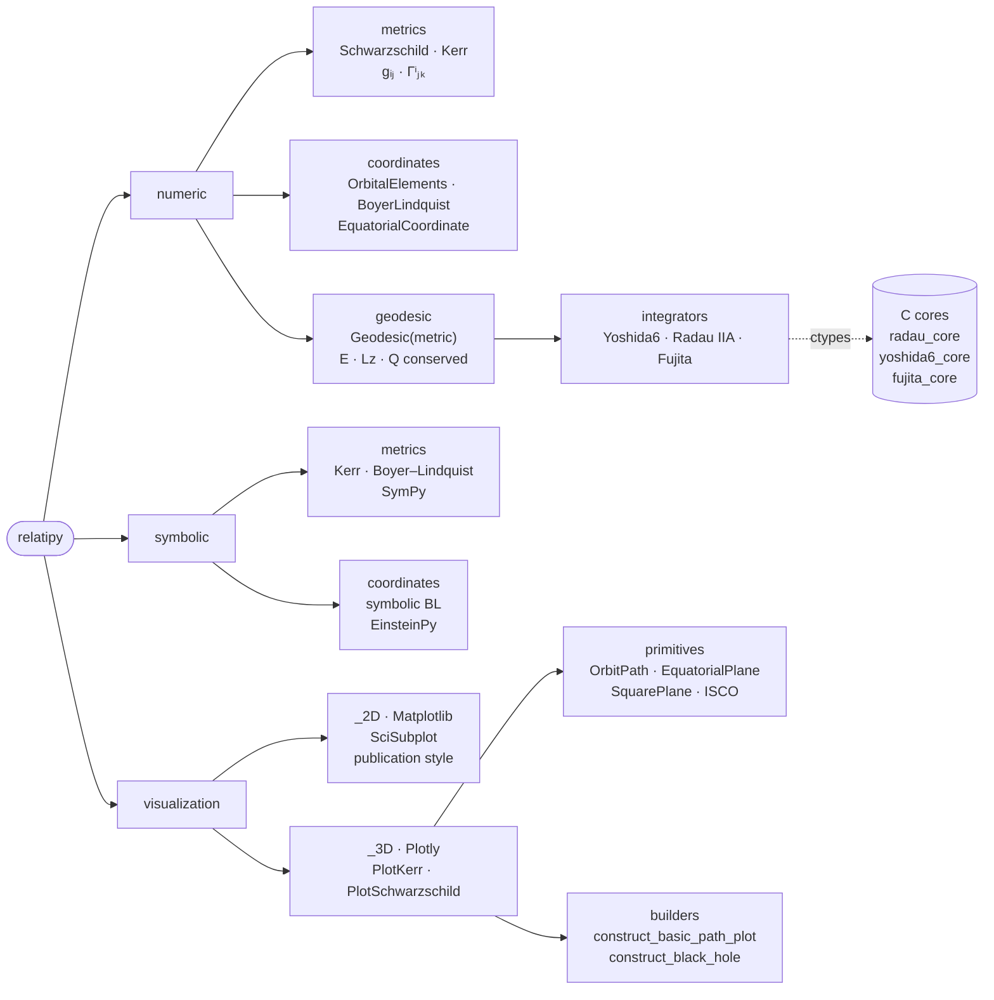

# RelatiPy — Architecture

```mermaid
flowchart LR
  RP(["relatipy"])

  %% ── numeric branch ──────────────────────────────────────────────
  RP --> NUM["numeric"]

  NUM --> MET["metrics\nSchwarzschild · Kerr\ngᵢⱼ · Γⁱⱼₖ"]
  NUM --> CRD["coordinates\nOrbitalElements · BoyerLindquist\nEquatorialCoordinate"]
  NUM --> GEO["geodesic\nGeodesic(metric)\nE · Lz · Q conserved"]

  GEO --> INT["integrators\nYoshida6 · Radau IIA · Fujita"]
  INT -. ctypes .-> CC[("C cores\nradau_core\nyoshida6_core\nfujita_core")]

  %% ── symbolic branch ──────────────────────────────────────────────
  RP --> SYM["symbolic"]

  SYM --> SMET["metrics\nKerr · Boyer–Lindquist\nSymPy"]
  SYM --> SCRD["coordinates\nsymbolic BL\nEinsteinPy"]

  %% ── visualization branch ─────────────────────────────────────────
  RP --> VIZ["visualization"]

  VIZ --> V2["_2D · Matplotlib\nSciSubplot\npublication style"]
  VIZ --> V3["_3D · Plotly\nPlotKerr · PlotSchwarzschild"]

  V3 --> PRI["primitives\nOrbitPath · EquatorialPlane\nSquarePlane · ISCO"]
  V3 --> BLD["builders\nconstruct_basic_path_plot\nconstruct_black_hole"]
```
